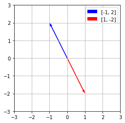
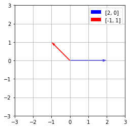

### The span of a set of vectors

We now return to our two fundamental questions, rephrased here in terms of matrix multiplication.
- Existence: Is there a solution to the equation $Ax = b$?
- Uniqueness: If there is a solution to the equation $Ax = b$, is it unique?

In this section, we focus on the **existence question** and see how it leads to the concept of the span of a set of vectors.

In this section, questions about the existence of solutions of a linear system lead to the concept of the span of a set of vectors. In particular, the span of a set of vectors $v_1, v_2, ... v_n$ is the set of vectors $b$ for which a solution to the linear system $[ v_1 v_2 ... v_n ]x = b$  exists.


---

**Notation 2.3.9**.  We will denote the span of the set of vectors $v_1, v_2, ... v_n$ by Span$`\{v_1, v_2, ..., v_n\}.`$

---
**Example 1** - Span{v, w} is a line



<details>
 <summary>Sympy Code</summary>
 
```python
import matplotlib.pyplot as plt

# Define the points
points = [[-1, 2], [1, -2]]

# Extract x and y coordinates
x_coords = [point[0] for point in points]
y_coords = [point[1] for point in points]

# Create a figure and axis
fig, ax = plt.subplots()

# Plot arrows from the origin to each point
ax.quiver(0, 0, x_coords[0], y_coords[0], angles='xy', scale_units='xy', scale=1, color='blue', label=points[0])
ax.quiver(0, 0, x_coords[1], y_coords[1], angles='xy', scale_units='xy', scale=1, color='red', label=points[1])

# Set limits
ax.set_xlim([-3, 3])
ax.set_ylim([-3, 3])

# Set aspect ratio
ax.set_aspect('equal')

# Add grid
ax.grid(True)

# Add legend
ax.legend()

# Show plot
plt.show()
```
</details>


```text
⎡-1  2   3⎤
⎢         ⎥
⎣1   -2  0⎦

Matrix A with b=[3, 0]: No Solution.
  Inconsistent - rightmost column has pivot
  Basic Variable Columns: [0] (pivot cols)
  Free Variable Columns: [1] (cols without pivots)
  Solution: []

⎡1  -2  0⎤
⎢        ⎥
⎣0  0   1⎦
```

<details>
 <summary>Sympy Code</summary>
 
```python
 A = Matrix([
    [-1, 2, 3],
    [1, -2, 0],
])

pprint(A)
print()
print("Matrix A with b=[3, 0]:", solution_details(A))
pprint(A.rref()[0])
```

</details>

```text
⎡-1  2   3 ⎤
⎢          ⎥
⎣1   -2  -3⎦

Matrix A: Infinitely Many Solutions (>= 1 coeff col with no pivots):
  Basic Variable Columns: [0] (pivot cols)
  Free Variable Columns: [1] (cols without pivots)
  Solution: [{x0: 2*x1 - 3}]

⎡1  -2  -3⎤
⎢         ⎥
⎣0  0   0 ⎦
```

<details>
 <summary>Sympy Code</summary>
 
```python
A = Matrix([
    [-1, 2, 3],
    [1, -2, -3],
])

pprint(A)
print()
print("Matrix A:", solution_details(A))
pprint(A.rref()[0])
```

</details>

---
**Example 2** - Span{v, w} = $ℝ^2$



<details>
 <summary>Sympy Code</summary>
 
```python
import matplotlib.pyplot as plt

# Define the points
points = [[2, 0], [-1, 1]]

# Extract x and y coordinates
x_coords = [point[0] for point in points]
y_coords = [point[1] for point in points]

# Create a figure and axis
fig, ax = plt.subplots()

# Plot arrows from the origin to each point
ax.quiver(0, 0, x_coords[0], y_coords[0], angles='xy', scale_units='xy', scale=1, color='blue', label=points[0])
ax.quiver(0, 0, x_coords[1], y_coords[1], angles='xy', scale_units='xy', scale=1, color='red', label=points[1])

# Set limits
ax.set_xlim([-3, 3])
ax.set_ylim([-3, 3])

# Set aspect ratio
ax.set_aspect('equal')

# Add grid
ax.grid(True)

# Add legend
ax.legend()

# Show plot
plt.show()
```
</details>

---

**Definition 2.3.1.**  The span of a set of vectors $v_1, v_2, ... v_n$ is the set of all linear combinations that can be formed from the vectors.

Alternatively, if  $A = [ v_1 v_2 ... v_n ]$, then the span of the vectors consists of all vectors $b$ for which the equation $Ax = b$ is consistent.

---

### Pivot positions and span

> To summarize, we looked at the pivot positions in a matrix whose columns are the **three-dimensional** vectors $v_1, v_2, ... v_n$. We found that with
> - one pivot position, the span was a line.
> - two pivot positions, the span was a plane.
> - three pivot positions, the span was $`ℝ^3`$.

**Proposition 2.3.14.**  Suppose we have vectors $v_1, v_2, ... v_n$ in $`ℝ^m`$. Then Span$`\{v_1, v_2, ..., v_n\} = ℝ^m`$ if and only if the matrix $[ v_1, v_2, ..., v_n ]$ has a pivot position in every row.

> This tells us something important about the number of vectors needed to span $`ℝ^m`$. Suppose we have $n$ vectors $[ v_1, v_2, ..., v_n ]$ that span $`ℝ^m`$. The proposition tells us that the matrix $A = [ v_1 v_2 ... v_n ]$ has a pivot position in every row, such as in this reduced row echelon matrix.

```math
\begin{bmatrix}
\: 1 \; 0 \; * \; 0 \; * \; 0 \\
\: 0 \; 1 \; * \; 0 \; * \; 0 \\
0 \; 0 \;\;  0 \;\;  1 \; * \; 0 \\ 
0 \; 0 \;\;  0 \;\;  0 \;\;  0 \; 1 
\end{bmatrix}
```
(note: matrix formatting issues with github markdown)

> Since a matrix can have at most one pivot position in a column, there must be at least as many columns as there are rows, which implies that $`n\geq m`$. For instance, if we have a set of vectors that span $`ℝ^{632}`$., there must be at least 632 vectors in the set.


**Proposition 2.3.15.**  A set of vectors whose span is $`ℝ^m`$ contains at least $m$ vectors.

 ---

 **Terminology**.

Because span is a concept that is connected to a set of vectors, we say, “The span of the set of vectors 
$v_1, v_2, ..., v_n$ is ....” While it may be tempting to say, “The span of the matrix $A$ is ...,” we should instead say “The span of the columns of the matrix $A$ is ....”

---

### Extra - obtaining the span with SageMath

```python
# Create a matrix (replace with your actual matrix)
M = matrix([[1, 2], [3, 4]])

# Calculate the vector space spanned by the columns
V = M.column_space()

# Print the vector space (this will show a symbolic representation)
print(V)
```

Output:

```text
Free module of degree 2 and rank 2 over Integer Ring
Echelon basis matrix:
[1 1]
[0 2]
```

<details>
 <summary>Simplified description of output</summary>

When using SageMath to determine the span of a matrix in terms of familiar geometric spaces like R¹ (line) and R² (plane), you can primarily focus on the echelon output. Here's a breakdown of what to look for:

**Echelon Output and Span Interpretation:**

- **Number of Non-Zero Rows:**
    - **Equal to the number of columns:** This suggests the columns might span the entire space (depending on the specific vectors). It could be R¹ (line) for one column, R² (plane) for two columns, or higher dimensional spaces for more columns.
    - **Less than the number of columns:** This indicates the columns don't span the entire space.

- **Zero Rows:**
    - **No zero rows:** This suggests the columns are linearly independent, strengthening the possibility of spanning the entire space based on the number of non-zero rows.
    - **Zero rows:** These rows correspond to columns that are scalar multiples of other columns and don't contribute to the span.

**Example:**

- **Echelon form:**
    ```
    [1 2 0]
    [0 1 3]
    ```
  - **Interpretation:**
    - There are three columns, but only two non-zero rows. This suggests the columns might not span the entire R³ space.
    - No zero rows are present, indicating the two non-zero columns are linearly independent.
  - **Possible Span:** This matrix could potentially span a plane in R³ (though further analysis might be needed).

**Important Note:**

While the echelon form provides valuable clues, it may not always definitively determine the exact geometric space (like R¹ or R²). In some cases, additional properties of the vectors or their coefficients might be necessary for a complete picture.

**Additional Considerations:**

- For numerical matrices, libraries like NumPy use matrix rank as an indicator (rank equal to number of columns suggests potential for spanning the entire space).
- SageMath can provide a more symbolic representation of the vector space spanned by the columns.

I hope this explanation clarifies the role of the echelon output in interpreting the span of a matrix!
</details>

<details>
 <summary>Detailed description of output</summary>

The output from SageMath provides valuable information about the vector space spanned by the columns of your matrix. Here's a breakdown of what each part means:

**Free module of degree 2 and rank 2 over Integer Ring:**

- **Free module:** This indicates that the vector space is a free module, meaning any vector in this space can be uniquely represented as a linear combination of a set of basis vectors with no additional restrictions.
- **Degree 2:** This refers to the dimension of the vector space. In this case, the space has dimension 2, meaning it requires two independent vectors (basis vectors) to span all possible vectors within it. You can think of it as a 2D space.
- **Rank 2:** The rank refers to the number of linearly independent columns in the original matrix. Having a rank of 2 aligns with the degree of 2, suggesting that the two columns of the matrix are independent and sufficient to span the entire 2D space.
- **Over Integer Ring:** This specifies that the coefficients used to combine the basis vectors can be integers.

**Echelon basis matrix:**

  - **[1 1]**
  - **[0 2]:**
 
These rows represent the basis vectors in echelon form. However, SageMath doesn't directly output the actual basis vectors in this case.

**Interpretation:**

The output tells you that the columns of your matrix span a 2D vector space over the integers. In other words, any vector you can create using integer coefficients as weights for the two columns of your matrix will be a valid vector within this 2D space.

**Reconstructing Basis Vectors:**

While SageMath doesn't explicitly show the basis vectors, you can often reconstruct them from the echelon form matrix. However, this might not always be straightforward, especially with more complex matrices. Here's a general approach, but it may not always apply:

1. **Leading Variables:** Look for the columns with leading 1s in the echelon form. These columns correspond to variables that are not dependent on any other variable. In this example, both columns have a leading 1, so both variables are independent.
2. **Basis Vectors:** Set the non-leading variables in each row to 0 and create vectors from the remaining entries. These vectors often (but not always) represent the basis vectors. Here, you would get:
   - Basis vector 1: [1, 0]
   - Basis vector 2: [0, 2]

**Important Caveat:**

This reconstruction of basis vectors based on the echelon form might not always be a perfect representation due to potential row operations performed by SageMath during its internal calculations. It's generally recommended to rely on the information provided by SageMath itself (degree, rank) for interpreting the span of the vector space.

**In summary:**

The SageMath output confirms that the columns of your matrix span a 2D vector space over the integers. You can use this information to understand the range of vectors that can be formed from linear combinations of the columns and the overall dimensionality of the space spanned by the matrix.

</details>
