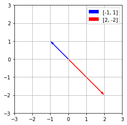

### The span of a set of vectors

We now return to our two fundamental questions, rephrased here in terms of matrix multiplication.
- Existence: Is there a solution to the equation $Ax = b$?
- Uniqueness: If there is a solution to the equation $Ax = b$, is it unique?

In this section, we focus on the **existence question** and see how it leads to the concept of the span of a set of vectors.

---

**Notation 2.3.9**.  We will denote the span of the set of vectors $v_1, v_2, ... v_n$ by Span$`\{v_1, v_2, ..., v_n\}.`$

---
**Example 1** - Span{v, w} is a line



<details>
 <summary>Sympy Code</summary>
 
```python
import matplotlib.pyplot as plt

# Define the points
points = [[-1, 2], [1, -2]]

# Extract x and y coordinates
x_coords = [point[0] for point in points]
y_coords = [point[1] for point in points]

# Create a figure and axis
fig, ax = plt.subplots()

# Plot arrows from the origin to each point
ax.quiver(0, 0, x_coords[0], y_coords[0], angles='xy', scale_units='xy', scale=1, color='blue', label=points[0])
ax.quiver(0, 0, x_coords[1], y_coords[1], angles='xy', scale_units='xy', scale=1, color='red', label=points[1])

# Set limits
ax.set_xlim([-3, 3])
ax.set_ylim([-3, 3])

# Set aspect ratio
ax.set_aspect('equal')

# Add grid
ax.grid(True)

# Add legend
ax.legend()

# Show plot
plt.show()
```
</details>


```text
⎡-1  2   3⎤
⎢         ⎥
⎣1   -2  0⎦

Matrix A with b=[3, 0]: No Solution.
  Inconsistent - rightmost column has pivot
  Basic Variable Columns: [0] (pivot cols)
  Free Variable Columns: [1] (cols without pivots)
  Solution: []

⎡1  -2  0⎤
⎢        ⎥
⎣0  0   1⎦
```

<details>
 <summary>Sympy Code</summary>
 
```python
 A = Matrix([
    [-1, 2, 3],
    [1, -2, 0],
])

pprint(A)
print()
print("Matrix A with b=[3, 0]:", solution_details(A))
pprint(A.rref()[0])
```

</details>

```text
⎡-1  2   3 ⎤
⎢          ⎥
⎣1   -2  -3⎦

Matrix A: Infinitely Many Solutions (>= 1 coeff col with no pivots):
  Basic Variable Columns: [0] (pivot cols)
  Free Variable Columns: [1] (cols without pivots)
  Solution: [{x0: 2*x1 - 3}]

⎡1  -2  -3⎤
⎢         ⎥
⎣0  0   0 ⎦
```

<details>
 <summary>Sympy Code</summary>
 
```python
A = Matrix([
    [-1, 2, 3],
    [1, -2, -3],
])

pprint(A)
print()
print("Matrix A:", solution_details(A))
pprint(A.rref()[0])
```

</details>

---
**Example 2** - Span{v, w} = $ℝ^2$


<details>
 <summary>Sympy Code</summary>
 
```python
import matplotlib.pyplot as plt

# Define the points
points = [[2, 0], [-1, 1]]

# Extract x and y coordinates
x_coords = [point[0] for point in points]
y_coords = [point[1] for point in points]

# Create a figure and axis
fig, ax = plt.subplots()

# Plot arrows from the origin to each point
ax.quiver(0, 0, x_coords[0], y_coords[0], angles='xy', scale_units='xy', scale=1, color='blue', label=points[0])
ax.quiver(0, 0, x_coords[1], y_coords[1], angles='xy', scale_units='xy', scale=1, color='red', label=points[1])

# Set limits
ax.set_xlim([-3, 3])
ax.set_ylim([-3, 3])

# Set aspect ratio
ax.set_aspect('equal')

# Add grid
ax.grid(True)

# Add legend
ax.legend()

# Show plot
plt.show()
```
</details>

---

**Definition 2.3.1.**  The span of a set of vectors $v_1, v_2, ... v_n$ is the set of all linear combinations that can be formed from the vectors.

Alternatively, if  $A = [ v_1 v_2 ... v_n ]$, then the span of the vectors consists of all vectors $b$ for which the equation $Ax = b$ is consistent.

---

### Pivot positions and span

> To summarize, we looked at the pivot positions in a matrix whose columns are the **three-dimensional** vectors $v_1, v_2, ... v_n$. We found that with
> - one pivot position, the span was a line.
> - two pivot positions, the span was a plane.
> - three pivot positions, the span was $`ℝ^3`$.

**Proposition 2.3.14.**  Suppose we have vectors $v_1, v_2, ... v_n$ in $`ℝ^m`$. Then Span$`\{v_1, v_2, ..., v_n\} = ℝ^m`$ if and only if the matrix $[ v_1, v_2, ..., v_n ]$ has a pivot position in every row.

> This tells us something important about the number of vectors needed to span $`ℝ^m`$. Suppose we have $n$ vectors $[ v_1, v_2, ..., v_n ]$ that span $`ℝ^m`$. The proposition tells us that the matrix $A = [ v_1 v_2 ... v_n ]$ has a pivot position in every row, such as in this reduced row echelon matrix.

```math
\begin{equation*}
\left[\begin{array}{rrrrrr}
1 \; 0 \; * \; 0 \; * \; 0 \\
0 \; 1 \; * \; 0 \; * \; 0 \\
0 \; 0 \; 0 \; 1 \; * \; 0 \\
0 \; 0 \; 0 \; 0 \; 0 \; 1 \\
\end{array}\right].
\end{equation*}
```

> Since a matrix can have at most one pivot position in a column, there must be at least as many columns as there are rows, which implies that $`n\geq m`$. For instance, if we have a set of vectors that span $`ℝ^632`$., there must be at least 632 vectors in the set.


**Proposition 2.3.15.**  A set of vectors whose span is $`ℝ^m`$ contains at least $m$ vectors.

 ---

 **Terminology**.

Because span is a concept that is connected to a set of vectors, we say, “The span of the set of vectors 
$v_1, v_2, ..., v_n$ is ....” While it may be tempting to say, “The span of the matrix $A$ is ...,” we should instead say “The span of the columns of the matrix $A$ is ....”

---
